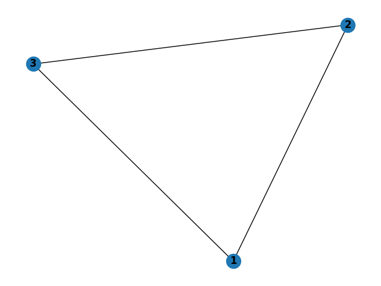

# stateful-graph-algos-haskell
Created as a final project for UIUC CS421 (under Prof. Mattox Beckman, Summer '23) by Douglas Issichopoulos

## Overview
A Haskell application with the following features:
* A `Graph` data type that allows for cycles (i.e., not just for trees).
* A `traversal` function that returns an in-order traversal of a graph via depth-first search. 
* A `shortestPathLens` function that returns the shortest path length between all nodes of a graph via breadth-first search.
* The above two functions are implemented in two ways: (1) using monads to maintain state, and (2) by simply passing state variables as arguments.
* A Python submodule using the `networkx` library to make expected outputs for unit tests for my Haskell implementations.
* A REPL of my Haskell application to allow the user build graphs and run the algorithms.

Code Structure:
* app/
  * [Main.hs](./app/Main.hs) &mdash; REPL
* graphs/ 
  * [edges/](./graphs/edges) &mdash; saved example graph edge text files
  * [imgs/](./graphs/imgs) &mdash; saved example graph images (created from Python submodule)
* python/ 
  * [graph_algos_networkx.py](./python/graph_algorithms_networkx.py) &mdash; Python submodule using `networkx` to check test cases and visualize graphs
* src/
  * [GraphAlgos.hs](./src/GraphAlgos.hs) &mdash; non-monadic implementations of graph algos
  * [GraphAlgosMonad.hs](./src/GraphAlgosMonad.hs) &mdash; monadic implementations of graph algos
  * [GraphsCommon.hs](./src/GraphsCommon.hs) &mdash; graph construction and common functions
  * [Parse.hs](./src/Parse.hs) &mdash; parsing graph edges entered into REPL
* test/
  * [Spec.hs](./test/Spec.hs) &mdash; HUnit unit tests

## How to Run
* download the code (e.g., `git clone https://github.com/dougissi/stateful-graph-algos-haskell.git`)
* navigate to the project directory (e.g., `cd stateful-graph-algos-haskell`)
* run all unit tests via `stack test`
* enter REPL via `stack run`

## REPL
A command line interface.

Commands:
* "exit" -> quit REPL
* "switch" -> switch between monadic and non-monadic implementations (default is monadic)
* "graph `edges`" -> build graph from `edges` which is of the form '(1,2) (2,3) ...'
* "graph f `filepath`" -> build graph from file at `filepath`
* "viewGraph" -> print current graph"
* "traversal `src`" -> print in-order traversal of current graph from `src` node
* "shortestPathLens" -> print shortest paths between all nodes of current graph (except those where no path exists)

Triangle Example:



The simple triangle graph above can be built using:
```
> graph (1,2) (1,3) (2,3)
Graph: 1->[2,3] 2->[1,3] 3->[1,2]
```

To obtain the in-order traversal from node `1`:
```
> traversal 1
[1,2,3]
```

To obtain the shortest path lengths between all nodes:
```
> shortestPathLens
[(1,[(2,1),(3,1)]),(2,[(1,1),(3,1)]),(3,[(1,1),(2,1)])]
```

To leave REPL:
```
> exit
Bye!
```

Notes:
* All graphs are built _undirected_. The edge `(1,2)` is equivalent to `(2,1)`.
* The order of edges matters only insofar as the neighbors of a given node are added in order of appearance. For example, if I enter `graph (1,3) (1,2)`, then node `1`'s neighbors will be ordered `[3,2]` (likewise the neighbors of nodes `2` and `3` with both be `[1]`).
* You can replace the currently loaded graph by simply entering a new graph.
* The underlying implementation of building a graph can be found in [./src/GraphsCommon.hs](https://github.com/dougissi/stateful-graph-algos-haskell/blob/ecc88b8624d22ac181da89047f7be3337468535a/src/GraphsCommon.hs#L22-L38).

## Python submodule
A simple Python3 submodule to calculate the traversal (from node `1`) and shortest path lengths and visualize a graph.

Required packages:
* networkx
* matplotlib

Setup:
* navigate to the python subdirectory (e.g., `cd python`)
* recommended to install the packages above in a virtual environment and then activate it
* run code using `python3 graph_algorithms_networkx.py --edges ../graphs/edges/triangle.txt` where you can replace `../graphs/edges/triangle.txt` with any file in [./graphs/edges](./graphs/edges) or create your own.